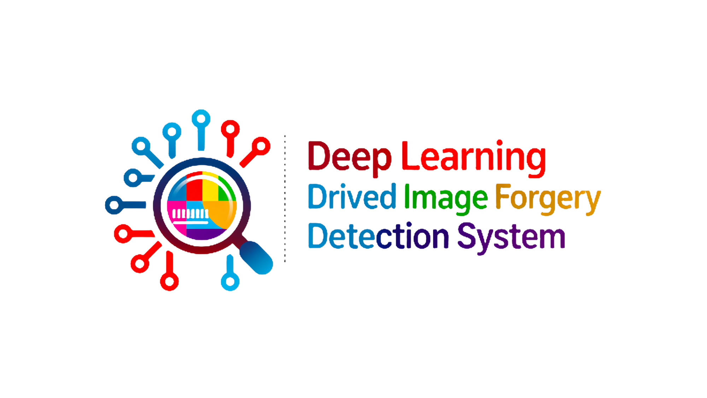
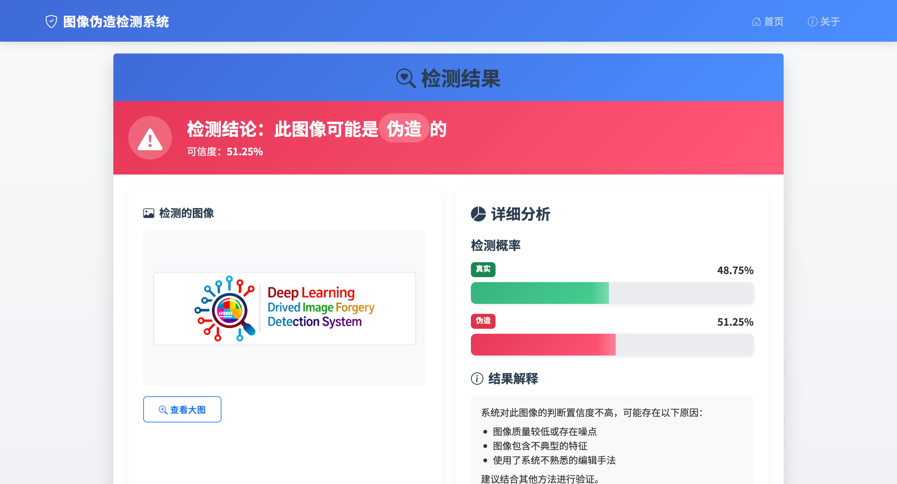

# 🔍 VerifyVision-Pro 🖼️

<div align="center">

<div style="width: 100%; max-width: 600px; margin: 0 auto;">
  
</div>

<br><br>


**深度学习驱动的图像伪造检测系统**  
**A Deep Learning-Powered Image Forgery Detection System**

[English](README_EN.md) | [中文](#chinese-documentation)

</div>

---

<a name="chinese-documentation"></a>
## 🔭 项目概述 <a name="项目概述"></a>

<div align="center">

### 🖥️ 系统界面示例



*图：VerifyVision-Pro Web界面 - 显示图像伪造检测结果和详细分析*

</div>

VerifyVision-Pro是一个综合性的基于深度学习的图像伪造检测系统，能够高精度地识别各种图像篡改。系统集成了强大的数据处理流程、先进的深度学习模型和直观的Web界面，实现实时检测功能。

### 🌟 主要特点

1. **🧠 多模型架构支持**：集成EfficientNet、ResNet、Xception、CNN等前沿深度学习模型，支持迁移学习和自定义架构，为不同场景提供最优检测方案

2. **🔄 端到端完整流程**：从原始数据预处理、模型训练、性能评估到生产部署的全链路解决方案，支持自动化数据增强和模型优化

3. **🎨 现代化Web界面**：基于Bootstrap 5.3.2构建的响应式用户界面，支持拖拽上传、实时预览、暗色主题切换，提供直观的检测结果可视化

4. **📊 智能分析引擎**：提供置信度评分、概率分布分析、混淆矩阵可视化，支持ROC曲线和AUC指标，帮助用户深入理解检测结果

5. **⚡ 高性能推理优化**：支持CUDA GPU加速、模型量化、批处理推理，毫秒级响应速度，可处理大规模图像检测任务

6. **🔧 企业级特性**：内置日志系统、错误处理、API接口、Docker容器化支持，满足生产环境部署需求

## 📁 项目结构 <a name="项目结构"></a>

```
VerifyVision-Pro/
│
├── data/                      # 数据目录
│   ├── real/                  # 真实图像
│   ├── fake/                  # 伪造图像
│   └── processed/             # 预处理后的图像
│
├── models/                    # 模型目录（已被git忽略）
│   └── saved/                 # 保存的模型权重
│
├── src/                       # 源代码
│   ├── data_utils/            # 数据处理工具
│   │   ├── dataset.py         # 数据集类
│   │   └── data_processor.py  # 数据预处理工具
│   │
│   ├── models/                # 模型定义
│   │   └── models.py          # 深度学习模型实现
│   │
│   ├── training/              # 训练相关
│   │   ├── train.py           # 训练脚本
│   │   └── evaluate.py        # 评估脚本
│   │
│   └── web/                   # Web应用
│       └── app.py             # Flask应用
│
├── static/                    # 静态资源
│   ├── css/                   # CSS样式
│   │   └── style.css          # 自定义样式
│   │
│   ├── js/                    # JavaScript
│   │   └── main.js            # 主JS文件
│   │
│   └── uploads/               # 用户上传的图像
│
├── templates/                 # HTML模板
│   ├── base.html              # 基础模板
│   ├── index.html             # 首页
│   ├── result.html            # 结果页面
│   └── about.html             # 关于页面
│
├── generate_test_images.py    # 测试图像生成脚本
├── main.py                    # 项目主入口程序
├── requirements.txt           # 项目依赖
└── README.md                  # 项目说明
```

## 💻 系统要求 <a name="系统要求"></a>

### 最低配置

- **Python**: 3.7+
- **PyTorch**: 2.0+
- **内存**: 4GB（仅CPU），8GB（带GPU）
- **存储**: 代码和基本数据集需要1GB
- **操作系统**: Windows 10+, macOS 10.15+, Ubuntu 18.04+

### 推荐配置

- **Python**: 3.9+
- **PyTorch**: 2.0+（带CUDA支持）
- **GPU**: NVIDIA GPU，支持CUDA（8GB+显存）
- **内存**: 16GB
- **存储**: 扩展数据集需要10GB+
- **操作系统**: Ubuntu 20.04+或macOS 12+

## 📦 安装 <a name="安装"></a>

### 步骤1：克隆仓库

```bash
git clone https://github.com/lintsinghua/VerifyVision-Pro.git
cd VerifyVision-Pro
```

### 步骤2：创建虚拟环境（推荐）

```bash
# macOS/Linux
python -m venv imgvenv
source imgvenv/bin/activate

# Windows
python -m venv imgvenv
imgvenv\Scripts\activate
```

### 步骤3：安装依赖

```bash
pip install -r requirements.txt
```

### 步骤4：验证安装

```bash
# 检查PyTorch是否正确安装并支持CUDA（如果可用）
python -c "import torch; print('CUDA可用：', torch.cuda.is_available())"
```

### 可选：GPU配置

如果您有NVIDIA GPU，请确保安装了与您的PyTorch版本兼容的CUDA工具包和cuDNN。

## 🚀 快速开始 <a name="快速开始"></a>

按照以下指南快速设置和运行VerifyVision-Pro系统：

### 步骤1：生成测试数据 🎲

首先，为系统测试生成样本图像：

```bash
python generate_test_images.py
```

这将在相应的数据目录中创建20张真实图像和20张伪造图像。

### 步骤2：预处理图像 🖌️

准备用于模型训练的图像：

```bash
# 处理真实图像
python main.py preprocess --input-dir data/real --output-dir data/processed/real --target-size 224 224

# 处理伪造图像
python main.py preprocess --input-dir data/fake --output-dir data/processed/fake --target-size 224 224
```

### 步骤3：训练模型 🧠

使用预处理后的数据训练基本CNN模型：

```bash
python main.py train \
  --real-dir data/processed/real \
  --fake-dir data/processed/fake \
  --model cnn \
  --pretrained \
  --epochs 5 \
  --batch-size 4 \
  --save-dir models/saved
```

> **注意**：初始测试时，少量的epochs（如5）就足够了。若要提高性能，可增加训练周期。

### 步骤4：启动Web应用 🌐

启动Web界面以与训练好的模型交互：

```bash
python main.py web \
  --model-path models/saved/best_model.pth \
  --model-name cnn \
  --port 8080 \
  --debug
```

> **重要**：在macOS上，端口5000可能被AirPlay服务占用，建议使用端口8080。

### 步骤5：访问应用 🖱️

打开浏览器访问[http://localhost:8080](http://localhost:8080)即可使用系统。

## 📊 数据准备 <a name="数据准备"></a>

### 获取数据集 📥

有多种方法可以收集训练和测试数据：

#### 方法1：测试数据生成（推荐初学者使用）

内置脚本可生成用于测试的合成数据：

```bash
python generate_test_images.py
```

**功能说明：**
- 创建`data/real`和`data/fake`目录
- 生成20张具有随机内容的真实图像
- 创建20张对应的伪造图像
- 适用于初始系统测试和验证

#### 方法2：公开数据集

获取关于公开图像伪造检测数据集的信息：

```bash
python main.py download-info
```

这会显示图像伪造检测研究中常用的数据集链接，包括：
- CASIA v1.0和v2.0
- Columbia图像拼接检测
- CoMoFoD（拷贝-移动伪造数据集）
- Coverage
- IEEE IFS-TC图像取证挑战数据集

#### 方法3：自定义数据集创建

通过以下方法构建自己的数据集：

1. **收集真实图像**：
   - 将真实图像放入`data/real`目录
   - 使用个人照片或公共领域图像
   - 确保内容、光线条件和来源设备多样化

2. **创建伪造图像**：
   ```bash
   python main.py create-fake \
     --real-dir data/real \
     --fake-dir data/fake \
     --method splice \
     --num-images 1000
   ```

**可用伪造方法：**
- `splice`：组合来自不同图像的区域
- `copy`：复制同一图像内的区域
- `noise`：添加局部噪声以创建不一致
- `color`：在特定区域操作颜色属性

### 预处理数据 🔄

训练前，需要对图像进行预处理以保持一致性：

```bash
python main.py preprocess \
  --input-dir data/real \
  --output-dir data/processed/real \
  --target-size 224 224 \
  --max-images 5000
```

**预处理操作包括：**
- 调整为统一尺寸
- 标准化
- 可选的数据增强（旋转、翻转等）
- 格式标准化
- 可选的色彩空间转换

**参数说明：**
- `--input-dir`：源图像目录
- `--output-dir`：处理后图像的目标目录
- `--target-size`：输出尺寸（宽度 高度）
- `--max-images`：限制处理的图像数量（可选）
- `--augment`：应用数据增强（可选）

## 🏋️‍♂️ 模型训练 <a name="模型训练"></a>

### 从头开始训练模型

VerifyVision-Pro支持训练各种深度学习模型进行图像伪造检测：

```bash
python main.py train \
  --real-dir data/processed/real \
  --fake-dir data/processed/fake \
  --model efficientnet_b0 \
  --pretrained \
  --epochs 30 \
  --batch-size 32 \
  --learning-rate 0.001 \
  --save-dir models/saved \
  --early-stopping \
  --patience 5
```

### 可用模型

系统实现了多种最先进的架构：

| 模型 | 描述 | 参数数量 | 适用场景 |
|-------|-------------|------------|--------------|
| `cnn` | 自定义CNN | ~500K | 快速测试，有限数据 |
| `resnet18` | ResNet-18 | ~11M | 小型到中型数据集 |
| `resnet50` | ResNet-50 | ~25M | 中型数据集 |
| `efficientnet_b0` | EfficientNet-B0 | ~5M | 平衡性能 |
| `xception` | Xception | ~22M | 高级特征 |

### 训练参数

训练模块提供全面的自定义选项：

| 参数 | 描述 | 默认值 | 备注 |
|-----------|-------------|---------|-------|
| `--real-dir` | 真实图像目录 | - | 必需 |
| `--fake-dir` | 伪造图像目录 | - | 必需 |
| `--model` | 模型架构 | `efficientnet_b0` | 查看可用模型 |
| `--pretrained` | 使用预训练权重 | `False` | 标志 |
| `--epochs` | 训练周期 | `30` | |
| `--batch-size` | 批次大小 | `32` | 减小以降低内存占用 |
| `--learning-rate` | 学习率 | `0.001` | |
| `--weight-decay` | L2正则化 | `0.0001` | |
| `--save-dir` | 保存目录 | `models/saved` | |
| `--early-stopping` | 启用早停 | `False` | 标志 |
| `--patience` | 早停周期数 | `5` | |
| `--validation-split` | 验证数据比例 | `0.2` | |

### 训练过程

训练过程中，系统会：

1. 将数据分割为训练集和验证集
2. 加载或初始化所选模型架构
3. 如果请求了预训练权重，应用迁移学习
4. 使用指定学习率的Adam优化器进行优化
5. 实现学习率调度以获得更好的收敛性
6. 监控验证指标以防止过拟合
7. 根据验证精度保存表现最佳的模型
8. 生成训练曲线和性能统计

### 高级训练功能

- **早停**：当性能达到平台期时自动停止训练
- **学习率调度**：当进度停滞时降低学习率
- **检查点**：在训练期间定期保存模型
- **混合精度**：在硬件支持时使用FP16训练
- **梯度裁剪**：防止梯度爆炸
- **数据增强**：训练期间可选的实时增强

## 📏 模型评估 <a name="模型评估"></a>

### 评估模型性能

训练后，使用以下命令评估模型性能：

```bash
python main.py evaluate \
  --real-dir data/processed/real \
  --fake-dir data/processed/fake \
  --model efficientnet_b0 \
  --checkpoint models/saved/best_model.pth \
  --results-dir results \
  --confusion-matrix \
  --roc-curve
```

### 评估指标

评估模块提供全面的性能指标：

| 指标 | 描述 | 范围 |
|--------|-------------|-------|
| 准确率 | 总体正确预测比例 | 0-1 |
| 精确率 | 真阳性/预测阳性 | 0-1 |
| 召回率 | 真阳性/实际阳性 | 0-1 |
| F1分数 | 精确率和召回率的调和平均 | 0-1 |
| AUC-ROC | ROC曲线下面积 | 0-1 |
| 混淆矩阵 | 预测与真实值的可视化 | - |

### 高级评估功能

- **分类别分析**：真实和伪造类别的详细指标
- **置信度分布**：预测置信度的直方图
- **失败分析**：对错误分类样本的检查
- **特征可视化**：显示影响区域的激活图
- **交叉验证**：可选的k折交叉验证以获得稳健评估

### 解读结果

评估结果有助于理解：

- 模型对未见数据的泛化能力
- 模型是否偏向特定类别
- 导致检测失败的图像类型
- 预测的置信度水平
- 可能的改进领域

## 🌐 Web应用 <a name="web应用"></a>

### 启动Web界面

启动Web应用以与训练好的模型交互：

```bash
python main.py web \
  --model-path models/saved/best_model.pth \
  --model-name efficientnet_b0 \
  --port 8080 \
  --host 0.0.0.0 \
  --debug
```

### Web应用功能

VerifyVision-Pro的Web界面提供：

- **用户友好的上传**：简单的拖放或文件选择界面
- **实时分析**：即时处理和结果显示
- **视觉反馈**：清晰显示真伪结果和置信度分数
- **热力图可视化**：可选的可疑区域可视化
- **结果历史**：基于会话的分析图像历史
- **响应式设计**：适用于桌面和移动设备

### 设置参数

| 参数 | 描述 | 默认值 | 备注 |
|-----------|-------------|---------|-------|
| `--model-path` | 模型文件路径 | - | 必需 |
| `--model-name` | 模型架构 | - | 必需 |
| `--port` | 服务器端口 | `5000` | macOS上使用`8080` |
| `--host` | 主机地址 | `127.0.0.1` | 外部访问使用`0.0.0.0` |
| `--debug` | 启用调试模式 | `False` | 标志 |
| `--max-size` | 最大上传大小(MB) | `5` | |
| `--threshold` | 检测阈值 | `0.5` | 范围：0-1 |

### 使用Web应用 💻

1. **上传图像**：
   - 点击"选择文件"或将图像拖放到上传区域
   - 支持的格式：JPG、JPEG、PNG
   - 最大文件大小：5MB（可配置）

2. **分析图像**：
   - 点击"上传并检测"按钮
   - 系统通过模型处理图像

3. **查看结果**：
   - 显示真实/伪造分类结果
   - 置信度分数表示检测确定性
   - 可选的热力图可视化突出显示可疑区域
   - 附加元数据显示图像属性

4. **解读结果**：
   - 更高的置信度分数表示更大的确定性
   - 接近0.5的分数表示不确定性
   - 对于模糊的情况，考虑使用多个模型

### 部署选项

对于生产部署，考虑以下方案：

- **Nginx/Apache**：设置反向代理以提高安全性和性能
- **Docker**：容器化部署以保持环境一致性
- **云平台**：AWS、Google Cloud或Azure以实现可扩展性
- **SSL证书**：启用HTTPS以进行安全通信
- **访问限制**：防止服务滥用

## 🔧 技术实现 <a name="技术实现"></a>

### 核心技术

VerifyVision-Pro基于现代技术构建，以实现可靠的性能：

#### 数据处理
- **OpenCV**：图像加载、预处理和操作
- **PIL (Pillow)**：图像格式处理和转换
- **Albumentations**：高级数据增强流程
- **NumPy**：图像数据的高效数值运算

#### 深度学习框架
- **PyTorch**：主要深度学习框架
- **TorchVision**：预训练模型和数据集实用工具
- **CUDA**：用于训练和推理的GPU加速
- **torchinfo**：模型架构可视化和分析

#### 模型架构
- **EfficientNet**：资源高效的卷积架构
- **ResNet**：带跳跃连接的深度残差网络
- **Xception**：深度可分离卷积以提高效率
- **自定义CNN**：用于基本检测的轻量级架构

#### Web框架
- **Flask**：轻量级Web服务器实现
- **Werkzeug**：Web应用的WSGI实用工具库
- **Jinja2**：HTML生成的模板引擎
- **Flask-WTF**：表单处理和验证

#### 前端
- **Bootstrap**：响应式设计框架
- **JavaScript**：动态客户端功能
- **Chart.js**：结果的交互式可视化
- **Dropzone.js**：增强的文件上传体验

### 实现细节

#### 模型架构设计

系统实现了两类分类方法，包含：

- **特征提取**：卷积层捕获空间特征
- **特征聚合**：池化操作聚合局部信息
- **分类头**：全连接层用于最终预测
- **迁移学习**：预训练网络的适应
- **领域特定特征**：用于伪造检测的自定义层

#### 训练流程

训练系统实现：

- **数据集管理**：自定义PyTorch数据集用于高效加载
- **平衡采样**：确保类别平等表示
- **增强策略**：在训练期间应用以提高鲁棒性
- **混合精度**：在支持的情况下使用FP16加速训练
- **分布式训练**：可选的多GPU支持

#### 推理流程

推理系统包括：

- **预处理**：与训练流程一致
- **批处理**：高效处理多个图像
- **模型集成**：可选的多模型组合
- **后处理**：置信度校准和阈值处理
- **可视化**：生成解释性热力图

## 🔬 高级用法 <a name="高级用法"></a>

### 自定义模型开发

通过自定义模型架构扩展VerifyVision-Pro：

1. **添加新模型**：
   
   修改`src/models/models.py`以包括您的架构：

   ```python
   class CustomModel(nn.Module):
       def __init__(self, num_classes=2, pretrained=False):
           super(CustomModel, self).__init__()
           # 定义您的模型架构
           
       def forward(self, x):
           # 定义前向传播
           return x
   ```

2. **注册模型**：
   
   将您的模型添加到模型工厂：

   ```python
   def get_model(name, num_classes=2, pretrained=False):
       models = {
           # 现有模型
           'custom_model': CustomModel,
       }
       return models[name](num_classes=num_classes, pretrained=pretrained)
   ```

3. **使用您的模型**：
   
   ```bash
   python main.py train \
     --real-dir data/processed/real \
     --fake-dir data/processed/fake \
     --model custom_model \
     --epochs 30
   ```

### 高级数据集技术

通过高级数据集处理增强模型性能：

#### 合成数据生成

使用生成方法创建额外的训练数据：

```bash
python main.py generate-synthetic \
  --base-images data/real \
  --output-dir data/synthetic \
  --count 1000 \
  --techniques "copy,splice,removal,noise"
```

#### 跨数据集验证

测试模型在不同数据集间的泛化能力：

```bash
python main.py cross-validate \
  --train-real data/datasetA/real \
  --train-fake data/datasetA/fake \
  --test-real data/datasetB/real \
  --test-fake data/datasetB/fake \
  --model efficientnet_b0
```

#### 主动学习

实现主动学习以优先标注努力：

```bash
python main.py active-learning \
  --unlabeled data/unlabeled \
  --labeled data/labeled \
  --model-path models/saved/model.pth \
  --selection-method "entropy" \
  --batch-size 100
```

### 模型解释

通过高级可视化理解模型决策：

```bash
python main.py interpret \
  --image path/to/image.jpg \
  --model-path models/saved/model.pth \
  --method "gradcam" \
  --output-dir visualizations
```

可用的解释方法：
- `gradcam`：梯度加权类激活映射
- `lime`：局部可解释的模型不可知解释
- `shap`：Shapley加性解释
- `occlusion`：遮挡敏感性分析

## ⚡ 性能优化 <a name="性能优化"></a>

### 硬件加速

通过硬件优化最大化系统性能：

#### GPU加速

启用GPU加速以实现更快的训练和推理：

```bash
# 检查GPU可用性
python -c "import torch; print(torch.cuda.is_available(), torch.cuda.get_device_name(0) if torch.cuda.is_available() else '无GPU')"

# 使用GPU训练（如果可用则自动使用）
python main.py train --model efficientnet_b0 --batch-size 64 --real-dir data/processed/real --fake-dir data/processed/fake
```

#### 多GPU训练

将训练分布到多个GPU上以处理更大的模型：

```bash
python -m torch.distributed.launch --nproc_per_node=4 main.py train \
  --distributed \
  --real-dir data/processed/real \
  --fake-dir data/processed/fake \
  --model efficientnet_b0 \
  --batch-size 128
```

#### CPU优化

在GPU不可用时优化CPU性能：

```bash
# 设置CPU线程数
python main.py train --num-workers 8 --pin-memory --real-dir data/processed/real --fake-dir data/processed/fake
```

### 内存优化

管理内存使用以实现高效处理：

#### 批大小调整

根据可用内存调整批大小：

| 硬件 | 推荐批大小 |
|----------|------------------------|
| CPU | 8-16 |
| GPU 4GB显存 | 16-32 |
| GPU 8GB显存 | 32-64 |
| GPU 16GB+显存 | 64-128 |

```bash
# 内存有限时使用较小批大小
python main.py train --batch-size 8 --real-dir data/processed/real --fake-dir data/processed/fake

# 高端系统使用较大批大小
python main.py train --batch-size 128 --real-dir data/processed/real --fake-dir data/processed/fake
```

#### 梯度累积

在有限内存上使用大的有效批大小进行训练：

```bash
python main.py train \
  --batch-size 16 \
  --gradient-accumulation 4 \
  --real-dir data/processed/real \
  --fake-dir data/processed/fake
```

这模拟了64（16 × 4）的批大小，但只需要16个样本的内存。

### 推理优化

加速生产部署：

#### 模型量化

减少模型大小并提高推理速度：

```bash
python main.py quantize \
  --model-path models/saved/best_model.pth \
  --quantized-model-path models/saved/quantized_model.pth \
  --calibration-images data/processed/real
```

这可将模型大小减少高达75%，并将推理速度提高2-4倍。

#### 批量推理

同时处理多个图像：

```bash
python main.py batch-inference \
  --input-dir data/test \
  --output-file results.csv \
  --model-path models/saved/best_model.pth \
  --batch-size 32
```

#### 模型剪枝

移除不必要的连接以加快推理：

```bash
python main.py prune \
  --model-path models/saved/best_model.pth \
  --pruned-model-path models/saved/pruned_model.pth \
  --prune-ratio 0.3
```

## 🔨 常见问题解决 <a name="常见问题解决"></a>

### 常见问题及解决方案

本节解决常见问题：

#### 🔄 安装问题

##### CUDA兼容性问题

**症状**：PyTorch安装成功但CUDA未被检测到，或在GPU操作期间崩溃。

**解决方案**：
1. 确保版本兼容：
   ```bash
   # 检查CUDA版本
   nvcc --version
   
   # 安装兼容的PyTorch版本
   pip install torch==2.0.1+cu118 torchvision==0.15.2+cu118 -f https://download.pytorch.org/whl/torch_stable.html
   ```

2. 验证安装：
   ```bash
   python -c "import torch; print('CUDA可用：', torch.cuda.is_available())"
   ```

##### 包依赖冲突

**症状**：`pip install`因依赖冲突而失败。

**解决方案**：
1. 创建新的虚拟环境：
   ```bash
   python -m venv fresh_env
   source fresh_env/bin/activate
   ```

2. 逐个安装依赖：
   ```bash
   pip install numpy
   pip install torch torchvision
   pip install -r requirements.txt
   ```

##### Python版本兼容性问题

**症状**：使用较新版本的Python（如Python 3.13）安装依赖时出现错误，特别是与numpy、pkgutil等包相关的错误。

**解决方案**：
1. 使用Python 3.9-3.10版本创建虚拟环境：
   ```bash
   # 首先检查可用的Python版本
   which -a python3
   python3 -V
   /usr/bin/python3 -V  # 可能会显示系统Python版本
   
   # 使用兼容版本创建虚拟环境
   /usr/bin/python3 -m venv imgvenv
   source imgvenv/bin/activate
   ```

2. 验证Python版本：
   ```bash
   python -V  # 应显示兼容版本，如Python 3.9.x
   ```

3. 安装依赖：
   ```bash
   pip install -r requirements.txt
   ```

> **注意**：该项目的依赖与Python 3.8-3.10版本最为兼容。较新版本可能需要调整依赖版本或等待包更新以支持新的Python版本。

#### 🖥️ 运行时问题

##### macOS上的端口占用

**症状**：Web应用启动失败，提示"地址已被使用"错误。

**解决方案**：
1. 在macOS上，端口5000通常被AirPlay服务占用，建议使用其他端口（如8080）：
   ```bash
   python main.py web --model-path models/saved/best_model.pth --model-name cnn --port 8080
   ```

2. 或找到并终止使用端口5000的进程（不推荐，可能会影响系统服务）：
   ```bash
   sudo lsof -i :5000
   kill -9 <PID>
   ```

3. 也可以在启动Web应用时使用`--host`参数指定只在本地接口上监听：
   ```bash
   python main.py web --model-path models/saved/best_model.pth --model-name cnn --port 5000 --host 127.0.0.1
   ```

> **注意**：macOS Monterey及更新版本中，端口5000被AirPlay接收器服务预留。如需在默认端口运行，请在系统设置中禁用AirPlay接收器或选择其他端口。

##### 内存溢出(OOM)错误

**症状**：训练崩溃，出现"CUDA内存不足"或系统内存错误。

**解决方案**：
1. 减小批大小：
   ```bash
   python main.py train --batch-size 4 --real-dir data/processed/real --fake-dir data/processed/fake
   ```

2. 使用梯度累积：
   ```bash
   python main.py train --batch-size 2 --gradient-accumulation 8 --real-dir data/processed/real --fake-dir data/processed/fake
   ```

3. 使用更小的模型：
   ```bash
   python main.py train --model resnet18 --real-dir data/processed/real --fake-dir data/processed/fake
   ```

##### 数据集为空错误

**症状**：训练失败，提示"数据集为空"错误。

**解决方案**：
1. 验证目录路径：
   ```bash
   ls -la data/processed/real data/processed/fake
   ```

2. 检查文件格式（应为.jpg、.jpeg或.png）：
   ```bash
   find data/processed/real -type f | grep -v -E '\.(jpg|jpeg|png)$'
   ```

3. 生成测试数据以验证系统：
   ```bash
   python generate_test_images.py
   ```

#### 🏋️‍♂️ 训练问题

##### 模型性能不佳

**症状**：模型准确率低或训练期间没有改善。

**解决方案**：
1. 增加训练时长：
   ```bash
   python main.py train --epochs 50 --real-dir data/processed/real --fake-dir data/processed/fake
   ```

2. 尝试不同模型：
   ```bash
   python main.py train --model efficientnet_b0 --pretrained --real-dir data/processed/real --fake-dir data/processed/fake
   ```

3. 确保数据集平衡：
   ```bash
   python main.py analyze-dataset --real-dir data/processed/real --fake-dir data/processed/fake
   ```

4. 启用数据增强：
   ```bash
   python main.py train --augmentation --real-dir data/processed/real --fake-dir data/processed/fake
   ```

##### 训练平台期

**症状**：验证准确率在训练早期停止改善。

**解决方案**：
1. 调整学习率：
   ```bash
   python main.py train --learning-rate 0.0001 --real-dir data/processed/real --fake-dir data/processed/fake
   ```

2. 实现学习率调度：
   ```bash
   python main.py train --scheduler cosine --real-dir data/processed/real --fake-dir data/processed/fake
   ```

3. 尝试不同优化器：
   ```bash
   python main.py train --optimizer adamw --real-dir data/processed/real --fake-dir data/processed/fake
   ```

##### 过拟合

**症状**：训练准确率高但验证准确率低。

**解决方案**：
1. 添加正则化：
   ```bash
   python main.py train --weight-decay 0.001 --dropout 0.3 --real-dir data/processed/real --fake-dir data/processed/fake
   ```

2. 使用早停：
   ```bash
   python main.py train --early-stopping --patience 5 --real-dir data/processed/real --fake-dir data/processed/fake
   ```

3. 增加数据集大小或多样性。

## 📝 注意事项 <a name="注意事项"></a>

### 实用建议

#### 数据集质量

训练数据的质量直接影响模型性能：

- **规模**：良好性能至少需要每类1,000+图像
- **平衡**：保持真实和伪造图像数量相等
- **多样性**：包括各种图像来源、光照条件和内容
- **真实性**：确保"真实"图像确实未经处理
- **真实感**：创建代表现实操作方法的伪造图像
- **元数据**：保留相关元数据（相机型号、编辑软件等）

#### 模型选择

根据您的具体需求选择模型：

| 优先考虑 | 推荐模型 |
|----------|-------------------|
| 速度 | `cnn`或`resnet18` |
| 准确率 | `efficientnet_b0`或`xception` |
| 平衡性能 | `resnet18`或`efficientnet_b0` |
| 有限数据 | `cnn`配合大量增强 |
| 生产环境 | 多个模型的集成 |

#### 部署考虑因素

对于实际部署：

- **安全性**：实施速率限制和文件验证
- **可扩展性**：对高流量应用使用负载均衡
- **隐私**：考虑敏感材料的本地处理
- **透明度**：传达置信水平和局限性
- **更新**：定期用新的伪造技术重新训练
- **备选方案**：对关键或模糊情况有人工审核

#### 检测局限性

了解系统局限性：

- 检测准确率因伪造类型和质量而异
- 高级AI生成图像可能需要专门模型
- 非常小的操作可能被忽略
- 结果应被视为概率性的，而非确定性的
- 系统应作为更广泛验证策略的一部分

## 🤝 参与贡献 <a name="参与贡献"></a>

我们欢迎对VerifyVision-Pro的贡献！以下是您可以帮助的方式：

### 报告问题

- 使用GitHub issue跟踪器报告bug
- 包括详细的步骤以重现问题
- 必要时附加样本图像（确保您有权共享）
- 指定您的环境（操作系统、Python版本等）

### 开发流程

1. **Fork仓库**
2. **创建特性分支**：
   ```bash
   git checkout -b feature/your-feature-name
   ```
3. **做出更改**
4. **运行测试**：
   ```bash
   python -m pytest tests/
   ```
5. **提交拉取请求**

### 贡献领域

我们特别欢迎以下领域的贡献：

- **新模型**：最先进架构的实现
- **检测方法**：识别操作的新方法
- **UI改进**：增强Web界面和可视化
- **性能优化**：提高速度和资源使用
- **文档**：教程、示例和说明
- **本地化**：文档和界面的翻译

### 代码风格

请遵循以下准则：

- 符合PEP 8的Python代码
- 所有函数、类和模块的文档字符串
- 适当的类型提示
- 复杂逻辑的全面注释
- 新功能的单元测试

## 📄 许可证 <a name="许可证"></a>

VerifyVision-Pro在MIT许可证下发布。

### 第三方组件

本项目包含来自第三方开源项目的组件：

- PyTorch (BSD许可证)
- Flask (BSD许可证)
- TorchVision (BSD许可证)
- OpenCV (Apache 2.0许可证)
- Bootstrap (MIT许可证)
- 其他各种包，如requirements.txt中所列
---

⭐ 如果这个项目对您有帮助，请给我们一个 Star！
[](https://star-history.com/#lintsinghua/VerifyVision-Pro&Date)
